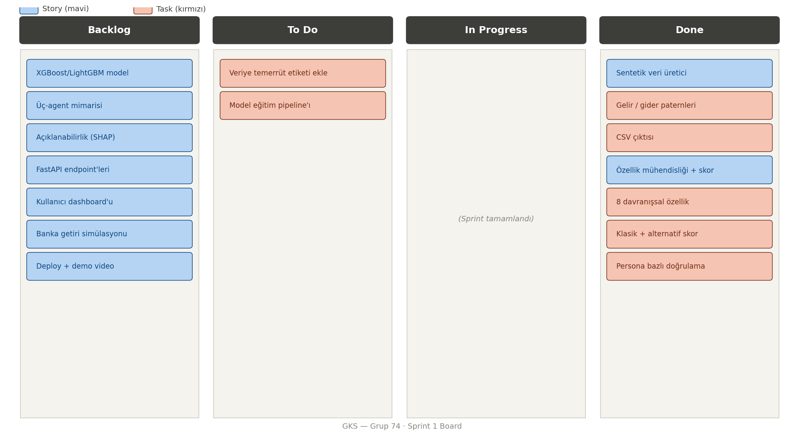
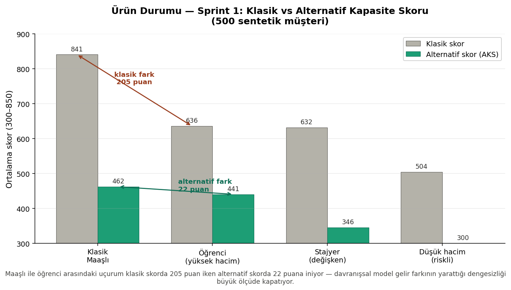
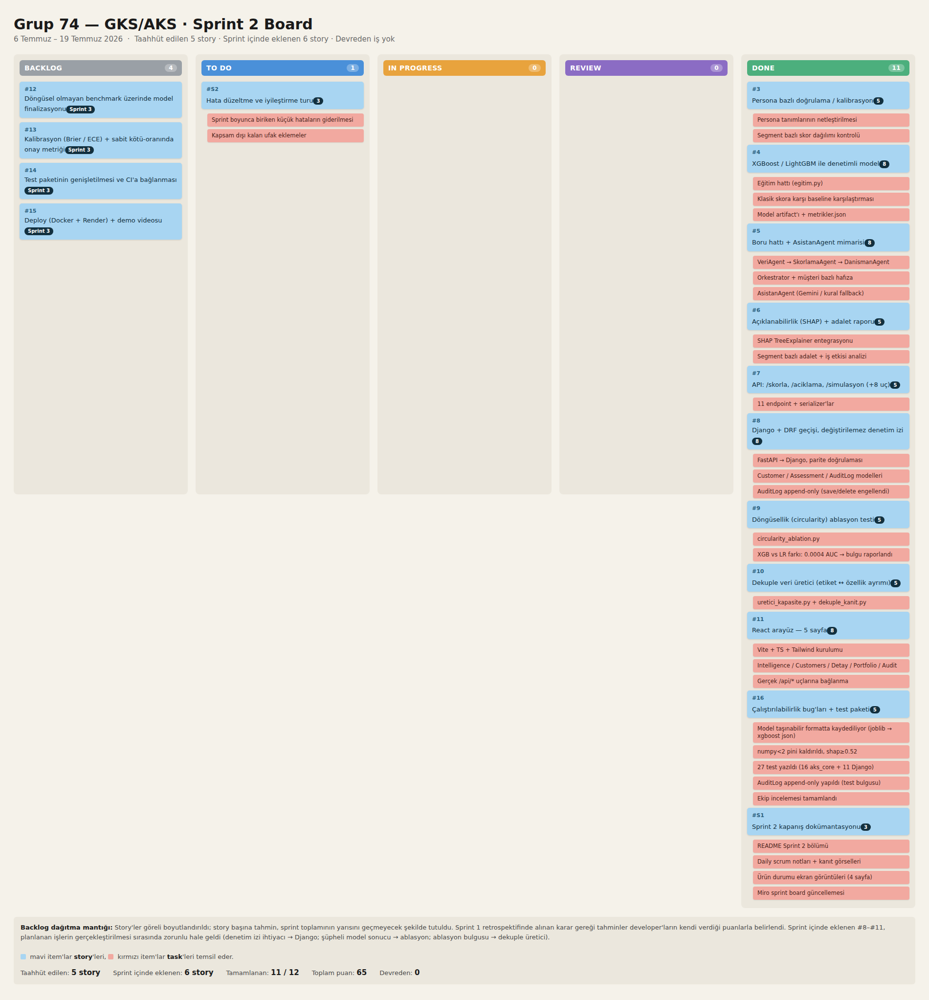
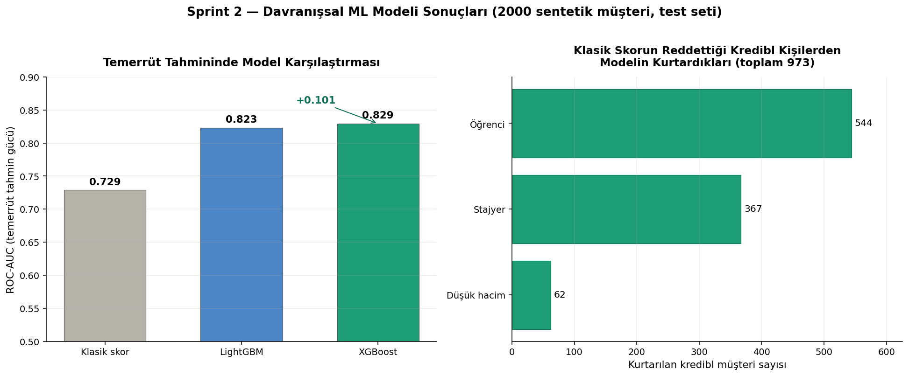
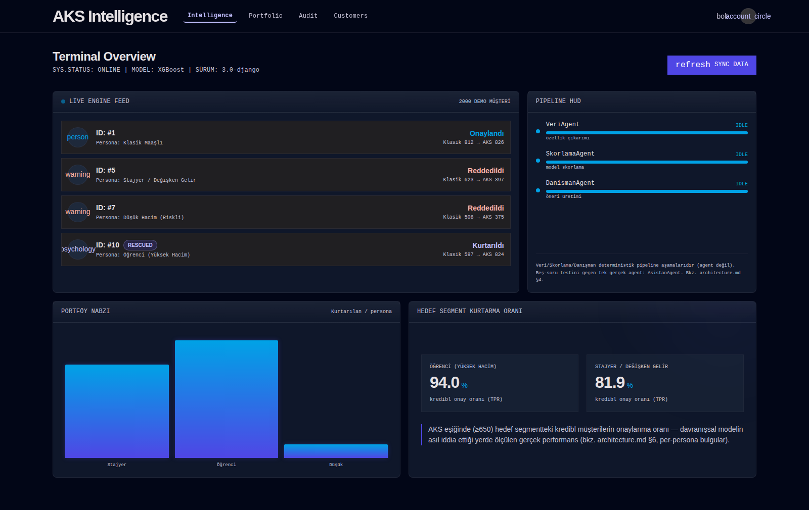
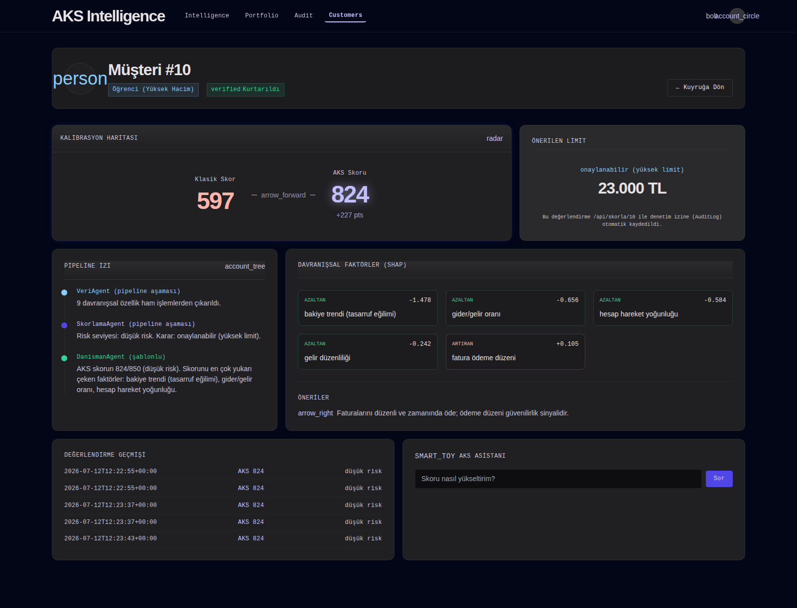
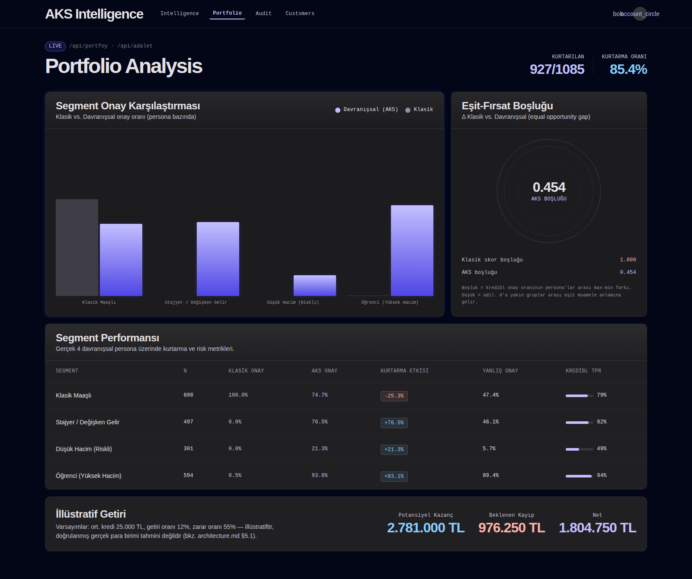
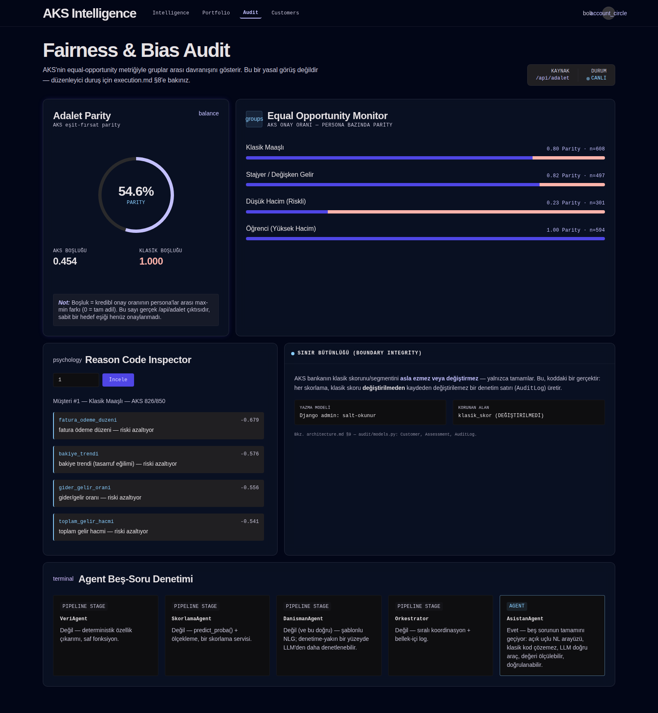

# Gerçek Kapasite Skoru (GKS) — Alternatif Kredi Değerlendirme Sistemi

> YZTA Bootcamp 2026 — 5. Akademi Dönemi · Yapay Zeka ve Veri Bilimi · Grup 74

## Takım

| Rol | Kişi |
|---|---|
| Product Owner | Alperen Karakaya |
| Scrum Master | Ahmet Özdoğan |
| Developer | Zeynep Salkaya |
| Developer | Havva Balta |

## 1. Problem

Geleneksel kredi/limit değerlendirme sistemleri büyük ölçüde **resmi gelir
beyanına** dayanır. Bu durum, hesap hareketleri açısından yüksek hacimli,
düzenli ve disiplinli olmasına rağmen resmi olarak "öğrenci", "stajyer" ya da
"freelancer" görünen kişilerin gerçek ödeme kapasitelerinin çok altında
kredi/limit almasına yol açıyor.

Odak noktamız özellikle küçük çaplı krediler: banka işlem hacmi yüksek olduğu
halde gelir seviyesi düşük görünen ya da stajyer/öğrenci profilindeki kişiler
çok düşük kredi limitleri alıyor. Aynı sorun büyük çaplı kredilerde de var, ama
asıl kayıp burada birikiyor. Banka açısından bu, **görünmeyen ama yakalanabilir
bir getiri kaybı**: düşük riskli ama "düşük skorlu" görünen büyük bir müşteri
segmenti ya hiç kredilenemiyor ya da alternatif (BNPL, P2P, enformel) kaynaklara
kayıyor.

Amacımız bu arayı kapatmak — hem müşterinin gerçek kapasitesine uygun limit
alması, hem de bankanın kaçırdığı getiriyi geri kazanması. İki taraf için de
kazançlı bir denge.

## 2. Çözüm

Hesap hareketlerinden (transaction) çıkarılan **9 davranışsal özellikle**
(gelir hacmi, gider hacmi, gelir işlem sayısı, gelir kaynağı çeşitliliği,
gelir düzenliliği, gider/gelir oranı, bakiye trendi, fatura ödeme düzeni,
hesap aktivite yoğunluğu) resmi gelirden bağımsız bir **Alternatif Kapasite
Skoru (AKS)** üretiyoruz.

Ürünün en kritik tasarım kararı bir sınır kuralı:

> **AKS, bankanın klasik skorunu veya segmentini asla ezmez, değiştirmez —
> yalnızca tamamlar.**

Bu bir vaat değil, kodda zorlanan bir kısıt: her skorlama, bankanın klasik
skorunu **değiştirilmemiş** haliyle kaydeden **değiştirilemez bir denetim
satırı** (immutable audit row) yazar. AKS bir karar motoru değil, klasik
skorun göremediği kapasiteyi yüzeye çıkaran bir **köprü katmanıdır**.

## 3. Hedef Kitle / Persona'lar

| Persona | Tanım |
|---|---|
| `ogrenci_yuksek_hacim` | Resmi geliri zayıf, ama burs + part-time + aile desteği ile yüksek hacimli ve düzenli hareket eden öğrenci — asıl odak grubumuz |
| `stajyer_degisken_gelir` | Stajyer/freelancer, toplamda yüksek ama zaman içinde düzensiz gelir |
| `klasik_maasli` | Sabit, resmi aylık maaşlı çalışan (kontrol/baseline grubu) |
| `dusuk_hacim_riskli` | Gerçekten düşük kapasiteli, düzensiz hareketli kişi (negatif kontrol — modelin yanlışlıkla yüksek skor vermemesi gerekiyor) |

## 4. Mimari (Sprint 3 — çalışan hâli)

```
React (Vite + TS + Tailwind)  →  Django 5.2 + DRF (11 endpoint)  →  aks_core
       5 sayfa                          │                             (Python paketi)
                                        │                                │
                                        │                    ┌───────────┴────────────┐
                                        │                    │ ozellik/  → 9 özellik  │
                                        │                    │ model/    → LojistikReg│
                                        │                    │             SHAP, adalet│
                                        │                    │ agents/   → pipeline + │
                                        │                    │             AsistanAgent│
                                        │                    └────────────────────────┘
                                        │
                        ┌───────────────┴───────────────┐
                        │ Supabase (Postgres)           │  → müşteri · değerlendirme
                        │   └ değiştirilemez audit_log  │    · denetim izi
                        │ Upstash Redis (cache)         │
                        └───────────────────────────────┘
```

Tüm dış servisler (Supabase, Upstash, Gemini) **opsiyoneldir**: kimlik bilgisi
yoksa sistem SQLite + bellek-içi cache + kural-tabanlı asistana düşer, yani
demo her koşulda çalışır.

### Agent mimarisi hakkında dürüst bir not

Boru hattı `VeriAgent → SkorlamaAgent → DanismanAgent` (`Orkestrator` ile
yönetiliyor) ve ayrıca bir `AsistanAgent` var. Bunları beş soruluk bir testten
geçirdik ("hangi problemi çözüyor, klasik ML neden çözemiyor, neden LLM/agent
gerekiyor, değeri nasıl ölçülüyor, gelişimi nasıl doğrulanıyor"). Sonuç:
**gerçekten agent olan tek bileşen `AsistanAgent`** (bağlama dayalı, Gemini
veya kural-tabanlı soru-cevap katmanı). Diğer üçü deterministik boru hattı
adımları ve materyallerde bu şekilde adlandırılıyor. **LLM hiçbir noktada karar
motoru değildir.**

## 5. Klasör Yapısı

```
yzta-bootcamp-grup74/
├── overview.md              # Vizyon, problem, istatistik & AI felsefesi, kararlar
├── architecture.md          # Mühendislik spesifikasyonu (her bileşen neden var)
├── execution.md             # Canlı plan: backlog, riskler, teknik borç, açık sorular
├── planning/                # Veri mimarisi, özellik şeması, pipeline adımları
├── sprints/docs/            # Sprint kanıtları: daily scrum, board, ürün ekranları
└── product/                 # Ürünün kendisi — 5 iş akışı
    ├── 01-data/             Sentetik işlem üretici, veri setleri, veri sözlüğü
    ├── 02-ai-agents/        aks_core paketi (ozellik · model · agents · artifacts)
    ├── 03-frontend/         React + Vite + TS + Tailwind, 5 sayfa
    └── 04-backend/          Django + DRF, audit app, ayarlar
```

## 6. Çalıştırma

```bash
# 1) Veri üret
cd product/01-data/generator
python3 -m veri.uretici --musteri-sayisi 2000 --gun 180

# 2) Modeli eğit
cd ../../02-ai-agents
pip install -e .
python3 -m aks_core.model.egitim

# 2b) Değerlendirme raporunu üret (CV + bootstrap CI + Brier/ECE)
python3 -m aks_core.model.degerlendirme

# 3) API'yi ayağa kaldır
cd ../04-backend
pip install -r requirements.txt
python3 manage.py migrate && python3 manage.py runserver

# 4) Arayüz
cd ../03-frontend
npm install && npm run dev
```

Seed sabit olduğu için üretilen veri ve skorlar tekrarlanabilir. `.env`
olmadan sistem SQLite + LocMem cache ile çalışır.

## 7. API Uçları (Django + DRF)

| Uç | İş |
|---|---|
| `GET /api/bilgi` | Servis ve model bilgisi |
| `GET /api/demo-musteriler` | Demo müşteri listesi |
| `POST /api/skorla` | Ham işlemlerden skor üret |
| `GET /api/skorla/<id>` | Demo müşteriyi skorla |
| `POST /api/aciklama` | SHAP tabanlı "neden bu skor?" |
| `POST /api/simulasyon` | "Şunu değiştirirsem skorum ne olur?" |
| `GET /api/portfoy` | Banka portföy görünümü |
| `GET /api/adalet` | Segment bazlı adalet raporu |
| `POST /api/csv-skorla` | Toplu CSV skorlama |
| `POST /api/asistan` | `AsistanAgent` soru-cevap |
| `GET /api/gecmis/<id>` | Müşteri skor geçmişi (denetim izi) |

## 8. Product Backlog

Backlog Miro üzerinde tutuluyor (link aşağıda); story bazlı özet:

| # | User Story | Sprint | Durum |
|---|---|---|---|
| 1 | Sentetik işlem verisi üretici | 1 | ✅ |
| 2 | Özellik mühendisliği + baseline skor | 1 | ✅ |
| 3 | Persona bazlı doğrulama / kalibrasyon | 2 | ✅ |
| 4 | XGBoost/LightGBM ile denetimli model | 2 | ✅ (Sprint 3'te LR ile değiştirildi) |
| 5 | Boru hattı + `AsistanAgent` mimarisi | 2 | ✅ |
| 6 | Açıklanabilirlik katmanı (SHAP) + adalet raporu | 2 | ✅ |
| 7 | API `/skorla` `/aciklama` `/simulasyon` (+8 uç) | 2 | ✅ |
| 8 | Django + DRF geçişi, değiştirilemez denetim izi | 2 | ✅ |
| 9 | Döngüsellik (circularity) ablasyon testi | 2 | ✅ |
| 10 | Dekuple veri üretici (etiket ↔ özellik ayrıştırma) | 2 | ✅ |
| 11 | React arayüz — 5 sayfa | 2 | ✅ |
| 12 | Döngüsel olmayan benchmark üzerinde model finalizasyonu | 3 | ✅ |
| 13 | Kalibrasyon (Brier/ECE) | 3 | ✅ |
| 13b | Sabit kötü-oranında ek onay metriği | 3 | ⏳ |
| 14 | Test paketinin Django/`aks_core`'a taşınması | 3 | ✅ |
| 15 | Deploy (Docker + Render) + demo video | 3 | ⏳ |

---

# Product Backlog URL

[Miro linki](https://miro.com/app/board/uXjVH9d7vBk=/?share_link_id=459493776909)

---

# Sprint 1

**Sprint Notu:** Bu sprintte hedef, projenin veri temelini ve kavram kanıtını
(proof of concept) kurmaktı: sentetik banka işlem verisi üretmek, davranışsal
özellikleri çıkarmak ve resmi gelirden bağımsız bir baseline alternatif skor
üretip persona'lar üzerinde doğrulamak.

**Sprint içi kapsam ve tahmin:** Backlog story'leri göreli olarak boyutlandırıldı.
Sprint 1 kapsamı iki ana story'den oluştu — sentetik veri üreticisi ve özellik
mühendisliği + baseline skor — ve bunların alt task'lerinden. Story başına tahmin,
sprint toplamının yarısını geçmeyecek şekilde tutuldu.

**Puan tamamlama mantığı:** Backlog, ilk yapılacak story'lere göre düzenlendi.
Story başına tahmin puanı, sprint toplamının yarısından az tutuldu. Miro
Board'da kırmızı item'lar yapılacak işleri (task), mavi item'lar story'leri
temsil ediyor.

**Daily Scrum:** Daily Scrum toplantıları zaman kısıtı nedeniyle Slack üzerinden
(grup DM + huddle) yürütüldü. Toplantı notları
`docs/sprint1/daily_scrum_notlari.md` altında; ilgili Slack ekran görüntüleri de
aynı klasörde (`slack_01_fikir_tartismasi.png`, `slack_02_fikir_form_gorev.png`,
`slack_03_huddle_roadmap.png`, `slack_04_koordinasyon.png`).

**Sprint Board Update:**



**Ürün Durumu:**



**Sprint Review — alınan kararlar:**

- Sentetik veri üreticisi ve kural-tabanlı skorlama motoru çalışır durumda;
  testlerde bir problem görülmedi.
- Baseline model, hedeflenen etkiyi gösterdi: klasik skorda maaşlı ile öğrenci
  arasındaki ~205 puanlık uçurum, alternatif skorda ~22 puana iniyor. Negatif
  kontrol grubu (`dusuk_hacim_riskli`) beklendiği gibi düşük kaldı.
- Bir sonraki sprint'e taşınan işler: kural-tabanlı skorun XGBoost/LightGBM ile
  denetimli modele dönüştürülmesi ve açıklanabilirlik katmanı.
- Sentetik veri üreticisinde gider/gelir oranının olması gerekenden yüksek
  çıktığı fark edildi; kalibrasyon Sprint 2'ye alındı.
- Sprint Review katılımcıları: Alperen Karakaya, Ahmet Özdoğan, Zeynep Salkaya, Havva Balta

**Sprint Retrospective:**

- Takım içi görev dağılımı gözden geçirilip netleştirilecek.
- Tahmin puanları yeniden değerlendirilecek; sprint planlamada developer
  geri bildirimlerinin alındığından emin olunacak.
- Unit test'ler için ayrılan efor/saat arttırılmalı.

---

---

# Sprint 2

**Sprint Notu:** Sprint 1'de kural-tabanlı bir kavram kanıtı vardı. Bu sprintte
hedef, onu **çalışan bir ürüne** dönüştürmekti: denetimli ML modeli, açıklanabilirlik,
boru hattı + asistan mimarisi, kalıcı bir API ve arayüz. Sprint ortasında planda
olmayan ama planı değiştiren bir şey oldu — kendi başarı sayımızı denetledik ve
geçersiz olduğunu bulduk. Bu bulguyu sprintin en önemli teslimatı sayıyoruz.

**Sprint içi kapsam ve tahmin:** Sprint 1'den devreden 5 story (persona kalibrasyonu,
denetimli model, agent mimarisi, açıklanabilirlik, API) sprintin taahhüt edilen
kapsamıydı. Story'ler görece boyutlandırıldı, story başına tahmin sprint toplamının
yarısını geçmeyecek şekilde tutuldu. Sprint 1 retrospektifinde "tahmin puanları
gözden geçirilecek" kararı alınmıştı; bu sprintte tahminler developer'ların
kendi verdiği puanlarla belirlendi.

Sprint içinde kapsama **eklenen** 4 story (#8–#11), planlanan işlerin
gerçekleştirilmesi sırasında zorunlu hale geldi: FastAPI, denetim izi (audit trail)
ve migration ihtiyacını karşılayamadığı için Django'ya geçildi; model sonuçları
şüphe uyandırdığı için ablasyon testi yazıldı; ablasyon bulgusu da dekuple veri
üreticisini zorunlu kıldı. Tümü sprint sonunda `DONE`.

**Puan tamamlama mantığı:** Taahhüt edilen 5 story'nin tamamı bitti; ek olarak
sprint içinde açılan 4 story daha kapandı. Devreden iş yok. Miro board'da kırmızı
item'lar task'leri, mavi item'lar story'leri temsil ediyor.

**Daily Scrum:** Sprint 1'de olduğu gibi Daily Scrum'lar zaman kısıtı nedeniyle
Slack üzerinden (grup DM + huddle) yürütüldü. Notlar
`sprints/docs/sprint2/daily_scrum_notlari.md` altında, ilgili
Slack ekran görüntüleri aynı klasörde.

**Sprint Board Update:**



**Ürün Durumu:**

Model karşılaştırması (2000 sentetik müşteri, test seti):



| Model | ROC-AUC | Average Precision |
|---|---|---|
| XGBoost | 0.829 | 0.687 |
| LightGBM | 0.823 | 0.684 |
| Klasik skor (baseline) | 0.729 | 0.569 |

Çalışan arayüz — React + Vite + TS, Django API'ye canlı bağlı, 5 sayfa.
Aşağıdaki ekran görüntüleri çalışan uygulamadan alınmıştır.

**1. Intelligence — canlı skorlama akışı**

Model bilgisi, gerçek zamanlı skorlama akışı (klasik → AKS), agent boru hattı
durumu ve hedef segmentlerdeki kurtarma oranları. Öğrenci segmentinde kredibl
müşterilerin %94'ü AKS eşiğini geçiyor.



**2. Müşteri detayı — ürünün tezi tek ekranda**

Öğrenci profilindeki müşteri #10: klasik skor **597** ile reddedilirken, davranışsal
AKS skoru **824**. Sol üstte klasik skorun değiştirilmediğini gösteren sınır rozeti,
altta SHAP faktörleri, agent zinciri ve danışman önerileri.



**3. Portföy analizi — bankanın kaçırdığı getiri**

Segment bazında klasik ve davranışsal onay oranlarının karşılaştırması, eşit-fırsat
boşluğu ve illüstratif getiri hesabı. Öğrenci segmentinde klasik onay %0.5 iken AKS
onayı %93.6.



**4. Denetim izi — sınır bütünlüğünün kanıtı**

Her skorlama, bankanın klasik skorunu **değiştirilmemiş** haliyle kaydeden bir
denetim satırı yazar. `AuditLog` append-only'dir: güncellenemez, silinemez.
Adalet raporu ve agent beş-soru denetimi de bu sayfada.



### Sprint 2'de teslim edilenler

| Alan | Teslim |
|---|---|
| Veri | Kapasite-tabanlı yeni üretici, veri sözlüğü, şema + PII + döngüsellik doğrulaması (CI kapısı) |
| Model | XGBoost/LightGBM eğitimi, model artifact'ı, klasik skora karşı baseline karşılaştırması |
| Açıklanabilirlik | SHAP tabanlı açıklama, segment bazlı adalet raporu, iş etkisi analizi |
| Değerlendirme | Stratified k-fold CV + bootstrap %95 güven aralığı harness'ı, döngüsellik ablasyon testi |
| AI | Deterministik boru hattı (`VeriAgent → SkorlamaAgent → DanismanAgent` + `Orkestrator`) + `AsistanAgent` (Gemini / kural-tabanlı fallback) |
| Backend | FastAPI → Django 5.2 + DRF geçişi, 11 endpoint, değiştirilemez denetim izi, Supabase + Upstash entegrasyonu (graceful fallback) |
| Frontend | React + Vite + TS + Tailwind, 5 sayfa, tüm gerçek `/api/*` uçlarına bağlı |

### Sprint Review — alınan kararlar

- **Denetimli model çalışıyor.** XGBoost 0.829 AUC ile klasik skorun 0.729'unu
  geçiyor. Uçtan uca boru hattı (veri → özellik → model → API → denetim izi)
  ayakta ve tekrarlanabilir.

- **Ama bu sayı, tezimizi kanıtlamıyor — ve bunu biz bulduk.** Modelin eğitildiği
  9 özelliğin 4'ü (`gider_gelir_orani`, `bakiye_trendi`, `gelir_duzenliligi`,
  `fatura_odeme_duzeni`), sentetik etiketin **doğrudan üretildiği** değişkenler.
  Yani model, keşfetmesi gereken sinyali zaten biliyor. `circularity_ablation.py`
  ile ölçtük:
  - XGBoost ile 9 özellikli lojistik regresyon arasındaki fark: **0.0004 AUC** —
    yani "gelişmiş model" hiçbir şey katmıyor, kural yeniden inşa ediliyor.
  - "Nedensel olmayan" 5 özellik tek başına bile 0.82 AUC veriyor; sorun 4 kolonu
    saklayarak çözülmüyor, **yapısal**.
  - Sonuç: **0.829 vs 0.729 karşılaştırması inşa gereği doğru**, gizli kapasite
    kanıtı değil. Bu sayı boru hattının çalıştığını gösterir; iş tezini **göstermez**.

- **Sayıları saklamıyoruz, çerçeveliyoruz.** Yayımlanan tüm figürler (AUC 0.829,
  "973 kurtarılan müşteri", adalet farkı) bu uyarıyla birlikte sunuluyor. Bir
  sayının nasıl üretildiğini bilmeden savunmak, yanlış sayı üretmekten daha kötü.

- **Klasik yöntem varsayılan olarak kazanır.** Lojistik regresyon XGBoost'a eşit
  veya üstün (AUC, PR-AUC ve kalibrasyon) olduğu için raporlanan modelin LR'ye
  çevrilmesi Sprint 3'e alındı — ama ancak geçerli bir benchmark üzerinde karar
  verilecek.

- **Düzeltme yolu kuruldu.** Etiketi persona'dan ve özelliklerden ayıran dekuple
  veri üretici (`uretici_kapasite.py`) yazıldı ve kanıtlandı (`dekuple_kanit.py`:
  persona-etiket yayılımı 0.015; tek başına etikete eşit hiçbir özellik yok).
  Sprint 3'te bu etiket eğitim/değerlendirme hattına taşınacak.

- **FastAPI emekliye ayrıldı.** Denetim izi ve Supabase gereksinimleri ORM,
  migration ve read-only admin istediği için Django + DRF'e geçildi; parite
  doğrulandı. Eski kod `_legacy_fastapi/` altında referans olarak duruyor.

- **Sprint Review katılımcıları:** Alperen Karakaya, Ahmet Özdoğan,
  Zeynep Salkaya, Havva Balta

### Sprint Retrospective

**İyi giden:**
- Sprint 1'de devreden 5 story'nin tamamı kapandı, devir yok.
- Kendi sonucumuza şüpheyle bakıp ablasyon testi yazma refleksi, sprintin en
  değerli çıktısını üretti. Bir sonraki sprintte de "sayıyı önce kır, sonra
  yayımla" kuralını sürdürüyoruz.

**İyi gitmeyen:**
- **Repo yeniden yapılandırması takım hizası olmadan yapıldı.** Klasör yapısı
  sprint ortasında değişti; diğer geliştiriciler bir süre eski yollarla çalıştı.
  Karar: yapısal değişiklikler bundan sonra Daily Scrum'da duyurulup onaylanmadan
  main'e girmeyecek.
- **Sprint 1 retrospektifinde alınan "unit test eforu artırılacak" kararı
  gerçekleşmedi.** Aksine, Django geçişiyle mevcut 22 test kırıldı
  (FastAPI/`src.*` import ediyorlar). Sprint 3'ün ilk işi bunları taşımak —
  ve klasik skorun hiçbir agent tarafından değiştirilemediğini kanıtlayan
  sınır testlerini eklemek.
- Kapsam sprint içinde 5 story'den 9'a çıktı. Çıkan işler doğruydu ama
  planlanmamıştı; tahmin disiplini hâlâ oturmadı.

**Sprint 3'e taşınan kararlar:**
1. Dekuple etiketi eğitim/değerlendirme hattına taşı → dürüst headline sayı üret.
2. Kalibrasyonu (Brier/ECE) ana metrik yap; ham AUC'yi başlıktan çıkar.
3. Testleri Django + `aks_core`'a taşı, sınır testlerini ekle.
4. Deploy + demo videosu.

---

# Sprint 3

**Sprint Notu:** Sprint 2'nin sonunda elimizde çalışan bir boru hattı ve
kanıtlamadığı bir sayı vardı. Bu sprintin hedefi o sayıyı döngüsel olmayan
bir veri üzerinde yeniden üretmek ve ürünün iddiasını tek, savunulabilir bir
rakama oturtmaktı.

Hedeflenen rakam şu: **ince dosyalı ama gerçekte güvenilir müşterilerde,
sabit bir risk seviyesinde yüzde kaç daha fazla iyi müşteriyi
onaylayabiliyoruz** — güven aralığıyla birlikte. "No-go" da geçerli bir
sonuç olarak tanımlandı; sonucu bükmemek sprintin açık kuralıydı.

**Sprint içi kapsam ve tahmin:** Sprint 2'den devreden 4 story (#12–#15)
sprintin taahhüt edilen kapsamıydı. Sprint Planning'de (19 Temmuz gecesi, sprint penceresi açılmadan hemen önce) kapsam
dört çalışma başlığı altında yeniden düzenlendi: model optimizasyonu, karar
mekanizması değişiklikleri ve veri ile model eğitimi, frontend değişiklikleri,
metrik değişiklikleri.

Aynı huddle'da bootcamp teslim tarihinden bağımsız bir **iç takvim** kuruldu:
konuşulan değişiklikler 22 Temmuz'a kadar, projenin tamamı 29 Temmuz'a kadar
bitecek, kalan günler eklemeler ve kapanış için ayrılacak. Amaç, 2 Ağustos
teslimine üç günlük bir tampon bırakmaktı.

| Alan | Sahip |
|---|---|
| Araştırma | Havva |
| Model optimizasyonu ve metrik kontrolleri | Alperen, Ahmet |
| Veri ve sentetik veri hazırlığı | Zeynep |

**Puan tamamlama mantığı:** `<!-- TODO: teslim gününe göre doldurun -->`
Miro board'da kırmızı item'lar task'leri, mavi item'lar story'leri temsil ediyor.

**Daily Scrum:** Sprint 3, Sprint 1 ve 2'den farklı olarak sesli bir Sprint Planning
huddle'ı ile başladı; günlük koordinasyon yine Slack ve Instagram grup DM'i
üzerinden asenkron yürütüldü. Notlar
`sprints/docs/sprint3/daily_scrum_notlari.md` altında, ilgili ekran
görüntüleri aynı klasörde.

**Sprint Board Update:**

`<!-- TODO:  -->`

## Ürün Durumu

### 1. Dürüst benchmark devrede

Eğitim ve değerlendirme artık dekuple veri kaynağı üzerinde çalışıyor
(2000 sentetik müşteri, taban temerrüt oranı **%17.15**). Değerlendirme
yöntemi: `RepeatedStratifiedKFold(5×5)` ile ROC-AUC / PR-AUC + bootstrap
%95 güven aralığı, ayrıca 5-fold OOF üzerinden Brier, ECE, reliability
eğrisi ve persona bazlı kırılım.

| Model | ROC-AUC (%95 CI) | PR-AUC | Brier | ECE |
|---|---|---|---|---|
| **Lojistik Regresyon** | **0.8621** (0.8534–0.8707) | **0.6096** | **0.0979** | **0.0141** |
| XGBoost | 0.8399 (0.8306–0.8497) | 0.5571 | 0.1054 | 0.0337 |

Güven aralıkları kesişmiyor. Lojistik regresyon gradient boosting'i dört
metrikte de geçiyor — sadece daha basit olduğu için değil, daha iyi olduğu
için seçildi. Üretimdeki model `LogisticRegression`'a çevrildi (holdout
test AUC 0.8499).

Persona kırılımında da LR daha dengeli: negatif kontrol grubunda
(`dusuk_hacim_riskli`) 0.8857, odak grubumuzda (`ogrenci_yuksek_hacim`)
0.8637. XGBoost'ta aynı sayılar 0.8262 ve 0.8353 — boosting, ayırt etmesi
en kritik olan grupta daha zayıf.

### 2. Kalibrasyon: ölçtük, işe yaramadı, saklamıyoruz

Sprint 2'de "kalibrasyonu ana metrik yap" kararı almıştık. İzotonik
kalibrasyon eğitim hattına eklendi ve ölçüldü:

| | ECE |
|---|---|
| Kalibrasyon öncesi | 0.0391 |
| Kalibrasyon sonrası | 0.0394 |

Fark yok. Model zaten kalibre olduğu için düzeltilecek bir şey bulunamadı.
Bu bir başarısızlık değil ama kazanım da değil — adım hatta duruyor çünkü
veri değiştiğinde gerekebilir, ancak şu anki modelin kalibrasyonu izotonik
katmandan gelmiyor. Sayılar `egitim_manifest.json` içinde kayıtlı.

### 3. Cevaplanması gereken bulgu: klasik skorun sinyali kayboldu

Dekuple benchmark üzerinde klasik skorun ROC-AUC'si **0.4931**. Yani
rastgele tahminden ayırt edilemiyor. Sprint 2'nin döngüsel verisinde aynı
sayı 0.729'du.

Bunu bir bulgu olarak sunmuyoruz, çünkü büyük olasılıkla üreticinin kendi
kurgusundan geliyor: dekuple üretici etiketi resmi gelirden kasıtlı olarak
ayırıyor, klasik skor da resmi gelirden türetiliyor. Çıkan sonuç "klasik
skorun öngörü gücü yok" değil, "bu sentetik dünyada klasik skor tanım
gereği bilgi taşımıyor".

`<!-- TODO — takım kararı: Bu haliyle "AKS klasik skoru geçiyor"
karşılaştırması kurulamaz (0.86 vs 0.49 dürüst bir kıyas değil).
  (a) Üreticiye klasik skor için zayıf ama sıfır olmayan bir sinyal koymak
  (b) Karşılaştırmayı bırakıp AKS'yi mutlak metriklerle savunmak
Sprint Review'da karara bağlanacak. -->`

### 4. Test paketi yeniden kuruldu

Sprint 2'de Django geçişiyle kırılan 22 test yerine iki paket var:

| Paket | Test sayısı |
|---|---|
| `product/02-ai-agents/tests/test_aks_core.py` | 24 |
| `product/04-backend/api/tests.py` | 15 |

`<!-- TODO: Sprint 2 retrospektifinde "klasik skorun hiçbir agent tarafından
değiştirilemediğini kanıtlayan sınır testleri" sözü verilmişti. Varsa adlarını
yazın; yoksa yazın — ürünün en kritik iddiası bu. -->`

### 5. Sabit kötü-oranında ek onay metriği

`<!-- TODO — sprintin headline sayısı. Hesap: klasik skor ve AKS için
kötü-oranı (bad rate) sabitlenip her iki yöntemin hedef segmentteki onay
oranı karşılaştırılacak; fark bootstrap %95 CI ile raporlanacak.
Sonuç buraya. -->`

## Sprint 3'te teslim edilenler

| Alan | Teslim |
|---|---|
| Veri | Dekuple üretici eğitim/değerlendirme hattına taşındı; tüm metrikler bu kaynak üzerinde |
| Model | Model seçimi yeniden yapıldı; üretimdeki model `LogisticRegression` |
| Değerlendirme | 5×5 tekrarlı CV + bootstrap CI, OOF Brier/ECE/reliability, persona kırılımı |
| Kalibrasyon | İzotonik hat + öncesi/sonrası ECE kaydı |
| Test | 39 test (24 `aks_core` + 15 Django API) |
| Metrik | `<!-- TODO -->` |
| Frontend | `<!-- TODO -->` |
| Deploy | `<!-- TODO -->` |

## Sprint Review — alınan kararlar

`<!-- TODO — taslak, review'da teyit edilecek -->`

- **Basit model kazandı ve bunu raporluyoruz.** Lojistik regresyon dört
  metrikte de XGBoost'u geçtiği için üretimdeki model LR.

- **Başlıktaki sayı değişti.** Öne çıkardığımız rakam ham AUC değil, sabit
  kötü-oranında ek onay oranı — güven aralığıyla.

- **Klasik skor karşılaştırması askıya alındı.** `<!-- TODO: (a)/(b) -->`

- **Sprint Review katılımcıları:** Alperen Karakaya, Ahmet Özdoğan,
  Zeynep Salkaya, Havva Balta

## Sprint Retrospective

`<!-- TODO — taslak -->`

**İyi giden:**
- Sprint 2'de söz verilen test eforu bu sefer harcandı; kırık paket 39
  çalışan teste dönüştü.
- Kalibrasyonun işe yaramadığını ölçüp yazdık. Ölçmeseydik "kalibrasyon
  eklendi" diye yazacaktık — yanlış olmazdı ama boş olurdu.
- Ana hedef tek bir cümleye indirgendi ve "no-go da geçerli sonuç" kuralı
  baştan konuldu.

**İyi gitmeyen:**
- Demo verisi ile eğitim verisi sprint ortasına kadar farklıydı.
- `<!-- TODO -->`

**Sprint 3 sonrası açık kalan işler:**
1. `<!-- TODO -->`

---

## Etik & Regülasyon Notu

- Bu repo gerçek banka verisi içermez; tüm veriler sentetiktir.
- Üretimde KVKK kapsamında açık rıza ve veri minimizasyonu gerekir.
- Model, ayrımcı (discriminatory) sinyalleri (yaş, cinsiyet vb.) doğrudan
  kullanmaz; yalnızca davranışsal/finansal özelliklere dayanır.
