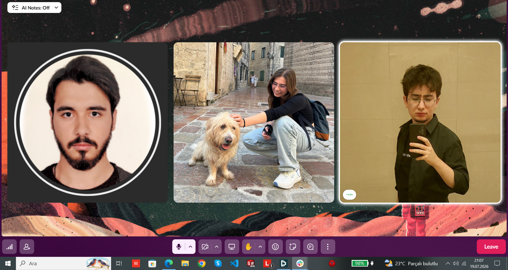
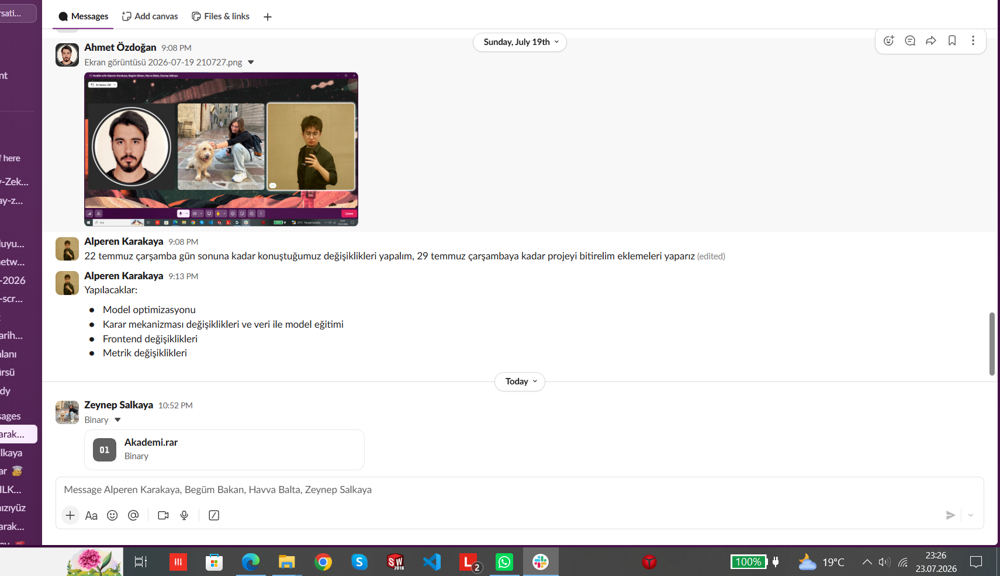
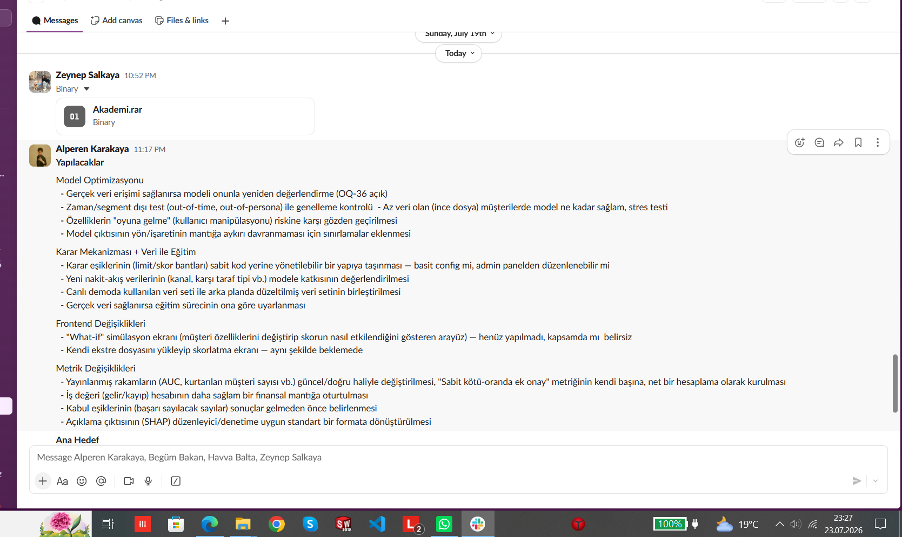
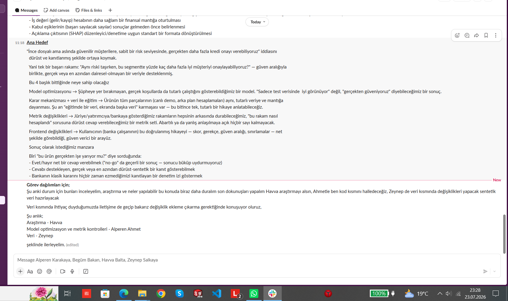
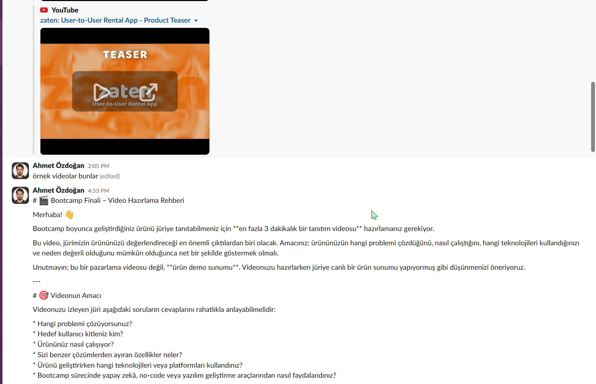
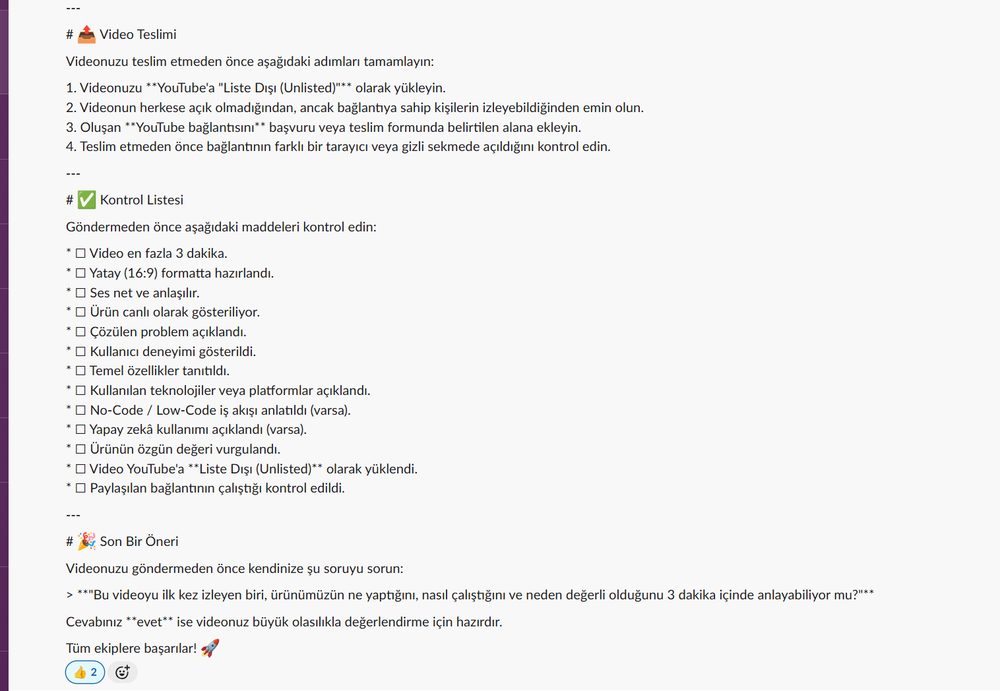
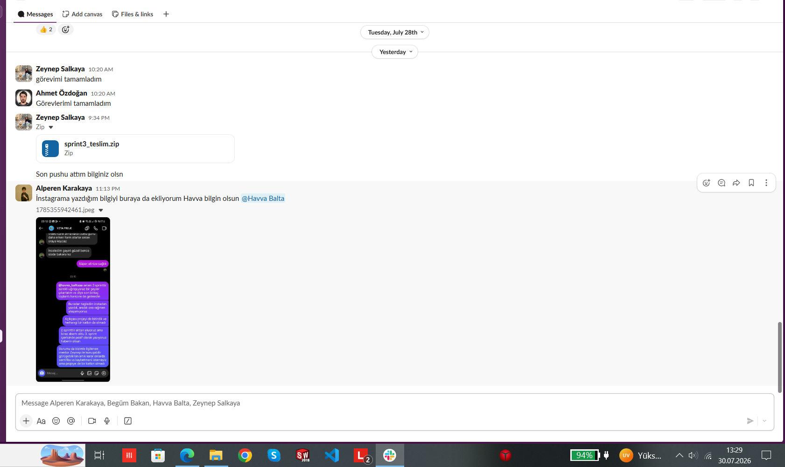

# Sprint 3 — Daily Scrum & Ekip Koordinasyon Notları

**Sprint aralığı:** 20 Temmuz – 2 Ağustos 2026
**Kanallar:** Slack (`#bootcamp-2026` + ekip kanalı), Instagram grup mesajlaşması
ve sesli huddle. Sprint 1 ve 2'de olduğu gibi toplantılar asenkron ve yazılı
yürütüldü; sprint açılışı sesli huddle ile yapıldı.

> Not: Aşağıdaki kayıtlar ekibin Slack yazışmalarından, Instagram grup
> mesajlarından ve huddle'lardan derlenmiştir. İlgili ekran görüntüleri bu klasörde.

---

## 19 Temmuz gecesi — Sprint Planning (huddle)

Sprint 3'ün resmi aralığı 20 Temmuz'da açılıyordu; ekip planlamayı bir gece
önce, 19 Temmuz akşamı sesli huddle'da yaptı. Sprint kapsamı ve iç takvim bu
toplantıda belirlendi ve sprint 20 Temmuz sabahı bu planla başladı.

- **Alperen (PO) — iç takvim:** Konuşulan değişikliklerin **22 Temmuz Çarşamba**
  gün sonuna kadar yapılması, projenin **29 Temmuz Çarşamba**'ya kadar
  bitirilmesi, kalan sürenin eklemeler için ayrılması kararlaştırıldı. Bootcamp
  teslim tarihi 2 Ağustos 23.59 olduğu için iç takvim üç günlük bir tampon
  bırakacak şekilde kuruldu.
- **Alperen (PO) — kapsam:** Sprint dört başlık altında toplandı: model
  optimizasyonu, karar mekanizması değişiklikleri ve veri ile model eğitimi,
  frontend değişiklikleri, metrik değişiklikleri.
- **Huddle katılımcıları:** Alperen Karakaya, Ahmet Özdoğan, Havva Balta,
  Zeynep Salkaya.

> Scrum'a göre her Sprint bir Sprint Planning ile başlar. Bu toplantı Sprint 3'ün
> planning etkinliğidir; takvimsel olarak sprint penceresinden birkaç saat önce
> yapılmıştır.

## 20 Temmuz — Dürüst benchmark hattı devreye alındı

Sprint 2'nin döngüsellik bulgusundan sonra ilk iş, dekuple veri üreticisini
eğitim ve değerlendirme hattına bağlamaktı.

- **Ahmet (SM):** Eğitim ve değerlendirme dekuple veri kaynağına taşındı
  (2000 müşteri, taban temerrüt oranı %17.15). Değerlendirme harness'ı
  `RepeatedStratifiedKFold(5×5)` + bootstrap %95 CI, OOF Brier/ECE/reliability
  ve persona bazlı kırılım üretecek şekilde genişletildi.
- **Bulgu — basit model kazandı:** Lojistik regresyon dört metrikte de
  gradient boosting'i geçti (AUC 0.8621 vs 0.8399, PR-AUC 0.6096 vs 0.5571,
  Brier 0.0979 vs 0.1054, ECE 0.0141 vs 0.0337). Güven aralıkları kesişmiyor.
  Sprint 2'de "klasik yöntem varsayılan olarak kazanır" diye bıraktığımız
  karar doğrulandı; üretimdeki model `LogisticRegression`'a çevrildi.
- **Bulgu — kalibrasyon fark yaratmadı:** İzotonik kalibrasyon eklendi ve
  ölçüldü. ECE 0.0391 → 0.0394. Model zaten kalibre olduğu için düzeltilecek
  bir şey bulunamadı. Adım hatta bırakıldı, kazanım olarak raporlanmıyor.
- **Ahmet (SM):** Django geçişinde kırılan test paketi yeniden kuruldu —
  24 `aks_core` + 15 Django API testi.

## 23 Temmuz — Veri paylaşımı, kapsamın detaylandırılması, görev dağılımı

- **Zeynep (Dev):** Hazırladığı veri paketini (`Akademi.rar`) ekip kanalında
  paylaştı.
- **Alperen (PO):** 19 Temmuz'da dört başlık olarak açıklanan kapsamı madde
  madde detaylandırdı ve sprintin ana hedefini yazıya döktü.
- **Ana hedef:** "İnce dosyalı ama aslında güvenilir müşterilere, sabit bir
  risk seviyesinde, gerçekten daha fazla kredi onayı verebiliyoruz" iddiasını
  dürüst ve kanıtlanmış şekilde ortaya koymak. Tek bir başarı rakamı
  hedefleniyor: *aynı riski taşırken bu segmentte yüzde kaç daha fazla iyi
  müşteriyi onaylayabiliyoruz* — güven aralığıyla ve dairesel olmayan veriyle.
- **Alperen (PO):** "No-go" da geçerli bir sonuç olarak tanımlandı. Sonucu
  bükmemek sprintin açık kuralı.
- **Engel — veri tutarsızlığı:** Canlı demoda kullanılan veri seti ile arka
  planda düzeltilmiş veri seti aynı değil. "Eğitimde bir veri, ekranda başka
  veri" durumu tek ve tutarlı bir hikâye anlatmayı engelliyor. → Birleştirme
  Zeynep'in kapsamında.
- **Engel — yayımlanmış rakamlar güncel değil:** README ve arayüzdeki AUC ve
  "kurtarılan müşteri" sayıları Sprint 2'nin döngüsel verisinden geliyor.
  → Metrik başlığı altında güncellenecek.
- **Engel — iç takvim kaydı:** 22 Temmuz hedefi tam olarak tutmadı; kapsamın
  detaylandırılması 23 Temmuz'a sarktı. 29 Temmuz hedefi korunuyor.

**Görev dağılımı:**

| Alan | Sahip |
|---|---|
| Araştırma | Havva |
| Model optimizasyonu ve metrik kontrolleri | Alperen, Ahmet |
| Veri ve sentetik veri hazırlığı | Zeynep |

Veri tarafında değişiklik/ekleme gerektiğinde ihtiyaç anında koordine
olunacak şekilde anlaşıldı.

- **Alperen (PO), aynı gün 23:10'da:** Havva'nın (araştırma sorumlusu) son
  birkaç toplantıya gelmediğini ve üç sprinttir katkı çıkmadığını Instagram
  grup kanalında @havva_baltaaa etiketiyle açıkça belirtti; ayrıca ayrı DM
  ve arama ile de ulaşmaya çalıştıklarını, sonuç alamadıklarını yazdı.

---

## 25 Temmuz (Cumartesi) — Güncel veri seti teslim edildi

- **Zeynep (Dev):** "Dosyaların güncel hali burada" — güncellenmiş veri
  paketini (`Akademi.rar`) ekip kanalında paylaştı. Bu teslim, 23 Temmuz'da
  açılan "demo verisi ile eğitim verisi farklı" engelini kapatan adım oldu:
  eğitim ve demo artık aynı güncel sete dayanıyor.

## 27 Temmuz (Pazartesi) — Çalışma huddle'ı

- **Sesli huddle (27 dk):** Alperen, Ahmet, Havva, Zeynep katıldı; devamında
  36 yanıtlı thread üzerinden senkron sürdü. Model/metrik durumunun ve kalan
  frontend + deploy işlerinin gözden geçirildiği ara senkron.

## 28 Temmuz (Salı) — Frontend, bug düzeltmeleri, deploy altyapısı, Havva bilgilendirmesi

**Gece:**
- **Havva (Dev):** Birkaç sayfada tasarım düzenlemesi yaptı ve çalışan
  arayüzün ekran görüntüsünü paylaştı (Operations Overview / terminal
  görünümü). "Nasıl buldunuz, ona göre diğerlerini de aynı stilde
  hazırlayacağım" diyerek geri bildirim istedi. Bu paylaşımın ardından
  herhangi bir push ya da devam eden bir katkı gelmedi.
- **Alperen (PO):** Frontend üzerinde ertesi gün Havva ile birlikte çalışma
  kararı aldı ("önyüzde beraber bakarız düzenleriz"). Ayrıca bir push attı:
  bug düzenlemeleri + Redis agent ve Supabase ayağa kaldırıldı ("çalışıyorlar");
  ekstra kontroller sürüyor. → Deploy altyapısı (#15) için ilk somut adım.
- **Alperen (PO), aynı gece:** 23 Temmuz'da Instagram'da Havva'ya yazdığı
  bilgilendirmeyi ekip Slack kanalına da ileterek `@Havva Balta` etiketiyle
  durumu tüm takıma açık şekilde duyurdu.

**Öğle/öğleden sonra:**
- **Alperen (PO):** "Bahsettiğim şeyleri ekledim ve bug testlerini yaptım,
  bir sorun gözükmüyor. Frontend kısmını da güncelleyip ileteceğim."
- **Ahmet (SM):** Bootcamp finali için video hazırlama rehberini paylaştı
  (≤3 dk demo, yatay 16:9, net ses, YouTube Unlisted) ve örnek tanıtım
  videolarını iletti. → Demo videosu çekimi kalan iş olarak netleşti.
- **Zeynep ve Ahmet:** Görevlerini tamamladıklarını bildirdi. Zeynep
  `sprint3_teslim.zip`'i yükleyip son push'u attığını duyurdu ("Son pushu
  attım bilginiz olsun").

## 30 Temmuz, 00:04 — Havva'nın yanıtı (Instagram)

Havva katkı sağlayamadığını, elinde olmayan sebeplerden dolayı ilk başta hiç
katılamadığını, sonra katılmaya çalıştığını ama yeterli bilgisi olmadığını,
UI/UX tasarım kısmına bakmayı düşündüğünü ama o kısmın zaten Alperen
tarafından yapılmış olduğunu ve yine ilgilenemediğini yazdı; süreçten devam
edemeyeceğini teyit etti.

**Ekip kararı (Alperen, Ahmet, Zeynep):** 27 Temmuz huddle'ına katılım ve
28 Temmuz'daki tek seferlik, geri bildirimi hiç gelmeyen tasarım paylaşımı
dışında Sprint 3 boyunca entegre edilmiş veya devam eden bir katkı
oluşmadı. Havva Sprint 3'te pasif olarak gösterilecek. Durum Academy Club
mentörüne (Zeliha Hanım) bildirildi ve onay alındı.

**30 Temmuz — bağımsız çalıştırma doğrulaması:** Proje sıfırdan kurulup
model eğitimi, sabit kötü-oranında ek onay metriği (`ek_onay.py`) ve 95
kişilik `aks_core` test paketi yeniden çalıştırıldı; tüm sayılar (LR AUC
0.8499; headline %86.8, CI %82.6–90.3; 95/95 test) `urun_ciktilari_sprint3.txt`
ile birebir eşleşti. Django API de gerçekten ayağa kaldırılıp oturumla
test edildi; `/api/skorla/5` yanıtı dokümantasyondaki örnekle birebir
eşleşti. **Bulgu:** `/api/portfoy` ucu, kendi yanıtında da belirttiği üzere
hâlâ döngüsel demo verisini kullanıyor — tekil skorlama zaten gerçek
dekuple/LR modeline geçmişken, toplu portföy görünümü henüz aynı kaynağa
taşınmamış. Bu, 23 Temmuz planındaki "demo verisi ile eğitim verisinin
birleştirilmesi" maddesinin API seviyesinde hâlâ tam kapanmadığının kanıtı.
Ham çıktı: `dogrulama_calistirma_sprint3.txt`.

## 29 Temmuz – 2 Ağustos — Kapanış

İç takvime göre proje 29 Temmuz'da bitmiş, kalan günler kapanış için
ayrılmış durumda. Kalan işler: demo videosunun çekilip YouTube'a (Unlisted)
yüklenmesi, frontend tasarım düzenlemelerinin push'lanması ve deploy'un
(#15) tamamlanması. Bu kalemler teslim (2 Ağustos 23.59) öncesi kapatılacak.

**Kanıt:** `instagram_havva_01.jpeg` (23 Temmuz, Alperen'in mesajı),
`instagram_havva_02.jpeg` (30 Temmuz, Havva'nın yanıtı),
`slack_06_havva_teslim.png` (28 Temmuz, ekip kanalına duyuru) — bu klasörde.

---

| Engel | Çözüm |
|---|---|
| Headline sayı Sprint 2'de yapısal olarak geçersiz çıkmıştı | Dekuple hat devreye alındı, tüm metrikler yeniden üretildi |
| Django geçişinde 22 test kırılmıştı | Test paketi iki pakete taşındı, 39 test çalışıyor |
| 22 Temmuz iç hedefi tam tutmadı | Kapsam 23 Temmuz'da netleşti; 29 Temmuz hedefi korundu |
| Demo verisi ile eğitim verisi farklı (eğitim tarafı) | 25 Temmuz'da güncel veri seti teslim edildi |
| Demo verisi ile eğitim verisi farklı (`/api/portfoy` tarafı) | Hâlâ açık — bkz. 30 Temmuz bağımsız doğrulama notu |
| Yayımlanmış rakamlar döngüsel veriden geliyor | Model eğitimi ve headline metrik güncellendi; portföy özeti hâlâ eski veride |

---

## Kanıt görüntüleri

**Huddle — Sprint Planning (19 Temmuz gecesi):**

**Slack — dokümantasyon ve duyurular:**

*19 Temmuz — iç takvim (22/29 Temmuz) ve dört başlıklı kapsam duyurusu*

*23 Temmuz — detaylı yapılacaklar listesi*

*23 Temmuz — sprintin ana hedefi ve görev dağılımı*

*25–27 Temmuz — güncel veri teslimi, huddle ve Havva'nın tasarım paylaşımı*

*28 Temmuz — frontend eşleşmesi, bug-fix push'u, Redis/Supabase ayağa kaldırma*

*28 Temmuz — Zeynep ve Ahmet görevlerini tamamladığını bildirdi, Zeynep
`sprint3_teslim.zip`'i yükleyip son push'u attığını duyurdu. Aynı akışta
Alperen, Havva'ya Instagram'da yazdığı bilgilendirmeyi ekip kanalına da
ileterek `@Havva Balta` etiketiyle durumu takıma açık şekilde duyurdu.*
